# 🎯 Sales Copilot - AI-Powered Sales Call Intelligence

<sub>*\* This README has been enhanced using LLM for improved documentation and visual diagrams*</sub>

An advanced conversational AI system that empowers sales teams to unlock insights from their call transcripts using cutting-edge retrieval-augmented generation (RAG), vector embeddings, and OpenAI's language models.

## 🚀 Quick Start

### Prerequisites

- Python 3.8+ (recommended: Python 3.10+)
- OpenAI API key with access to embedding and chat models
- 4GB+ RAM recommended for optimal FAISS performance

### Installation

1. **Clone the repository**
   ```bash
   git clone <repository-url>
   cd clari_round2-assignment-main
   ```

2. **Set up Python environment (recommended)**
   ```bash
   python -m venv venv
   source venv/bin/activate  # On Windows: venv\Scripts\activate
   ```

3. **Install dependencies**
   ```bash
   pip install -r requirements.txt
   ```

4. **Configure environment**
   ```bash
   cp .env.example .env
   # Edit .env and add your OpenAI API key:
   # OPENAI_API_KEY=your_actual_api_key_here
   ```

5. **Initialize the system**
   ```bash
   python setup.py
   ```
   This will:
   - Create the SQLite database
   - Process sample call transcripts
   - Generate vector embeddings
   - Build the FAISS index

6. **Start the interactive CLI**
   ```bash
   python run.py
   ```

## 📁 Project Structure

```
clari_round2-assignment-main/
├── 🚀 run.py                  # Main CLI application entry point
├── ⚙️ setup.py                # Database and index initialization
├── 🔧 conftest.py             # Pytest configuration
├── 📦 requirements.txt        # Python dependencies
├── 🌍 .env.example           # Environment configuration template
├── 📚 README.md              # This documentation
├── 📊 data/                  # Data storage and sample files
│   ├── 📞 1_demo_call.txt    # Sample: Product demonstration call
│   ├── 💰 2_pricing_call.txt # Sample: Pricing discussion call  
│   ├── ❓ 3_objection_call.txt # Sample: Objection handling call
│   ├── 🤝 4_negotiation_call.txt # Sample: Contract negotiation call
│   ├── 🗄️ sales_copilot.db  # SQLite database (created after setup)
│   ├── 🔍 faiss_index       # Vector search index (created after setup)
│   └── 📋 faiss_index.metadata # Index metadata
├── 🧠 src/                   # Core application modules
│   ├── 🤖 agent.py          # Main conversation agent
│   ├── ⚙️ config.py         # Configuration management
│   ├── 🔤 embeddings.py     # OpenAI embeddings & FAISS integration
│   ├── 📥 ingestion.py      # Call transcript processing pipeline
│   ├── 💬 prompts.py        # LLM prompt templates
│   ├── 🔍 retrieval.py      # RAG implementation & search engine
│   ├── 💾 storage.py        # SQLite database operations
│   └── 📝 text_processor.py # Text parsing and chunking
└── 🧪 tests/                # Comprehensive test suite
    ├── 🏃 run_tests.py      # Test runner
    ├── ⚙️ test_config.py     # Configuration tests
    ├── 📥 test_ingestion.py  # Data ingestion tests
    └── 🔍 test_retrieval.py  # Search and retrieval tests
```

## 🛠️ Technical Architecture & Design Decisions

### 🏗️ Storage Architecture

**SQLite + FAISS Hybrid Approach**
- **SQLite**: Structured data (metadata, chunks, relationships)
- **FAISS**: Vector embeddings for semantic search
- **Rationale**: Simple deployment, good performance for moderate scale, easy backup

**Schema Design**
```sql
-- Core call metadata
calls: call_id, filename, content, participants, created_at, metadata
chunks: chunk_id, call_id, content, speakers, timestamp, chunk_index
```

### Text Processing Strategy

**Chunking Strategy**
- Parse by speaker segments first
- Group into ~256 token chunks
- Preserve speaker context and timestamps
- **Rationale**: Maintains conversational context while staying within embedding limits

### Embedding and Retrieval

**OpenAI text-embedding-3-small**
- 1536 dimensions, cost-effective
- Good performance on conversational text
- **Rationale**: Balance of quality and cost

**FAISS IndexFlatIP**
- Inner product for cosine similarity
- Simple, reliable, good for moderate scale
- **Rationale**: Straightforward deployment, good retrieval quality
- Other indexes like IVF and HNSW can be used when there are huge number of chunks to optimize query time

### LLM Integration

**GPT-4o-mini for Generation**
- Cost-effective while maintaining quality
- Good instruction following for structured responses
- **Rationale**: Optimal cost/performance for this use case

## Testing

Run the test suite:

```bash
# Run all tests with coverage
python tests/run_tests.py
```

## Configuration

Environment variables (`.env`):

```env
OPENAI_API_KEY=your_openai_api_key_here
DATABASE_PATH=./data/sales_copilot.db
FAISS_INDEX_PATH=./data/faiss_index
DATA_DIRECTORY=./data
SRC_DIRECTORY=./src
CHUNK_SIZE=256
EMBEDDING_MODEL=text-embedding-3-small
LLM_MODEL=gpt-4o-mini
```

## 📝 Assumptions

1. **Transcript Format**: Files follow `[HH:MM] Speaker: Content` format
2. **Language**: English language calls (embedding model optimized for English)
4. **Concurrent Users**: Single-user CLI application
5. **Data Retention**: No automatic cleanup (manual management)
6. **Small Dataset**: Files do have low to medium word length and they are less in number

## 📊 Architecture Diagrams

### 🔄 System Architecture Flow

```mermaid
flowchart TD
    User[👤 User Input] --> CLI[🖥️ CLI Interface - run.py]
    CLI --> Agent[🤖 Sales Analysis Agent]
    
    Agent --> Intent[🎯 Intent Classifier<br/>LLM: GPT-4o-mini]
    Intent --> RAG_Route{Route Decision}
    
    RAG_Route -->|"Content Questions"| RAG[🔍 RAG Tool]
    RAG_Route -->|"Summary Requests"| SUMMARIZE[📝 Summarize Tool]
    RAG_Route -->|"Analytics Queries"| SQL[📊 SQL Tool]
    RAG_Route -->|"File Upload"| INGEST[📥 Ingest Tool]
    
    %% RAG Flow
    RAG --> EmbedQuery[🔤 Embed Query<br/>OpenAI text-embedding-3-small]
    EmbedQuery --> FAISS[(🔍 FAISS Vector Index<br/>IndexFlatIP)]
    FAISS --> RetrieveChunks[📄 Retrieve Relevant Chunks]
    RetrieveChunks --> SQLiteRead[(📊 SQLite Database<br/>Get Chunk Content)]
    SQLiteRead --> LLMGenerate[🤖 Generate Response<br/>GPT-4o-mini + Context]
    
    %% Summarize Flow
    SUMMARIZE --> SQLQuery1[(📊 SQLite Query<br/>Get Call Transcript)]
    SQLQuery1 --> LLMSummarize[🤖 Generate Summary<br/>GPT-4o-mini]
    
    %% SQL Flow
    SQL --> NLToSQL[🔧 Natural Language to SQL<br/>GPT-4o-mini]
    NLToSQL --> SQLExecute[(📊 Execute SQL Query<br/>SQLite Database)]
    SQLExecute --> FormatResult[📋 Format Results]
    
    %% Ingest Flow
    INGEST --> TextProcess[📝 Text Processor<br/>Parse & Chunk]
    TextProcess --> CreateEmbedding[🔤 Create Embeddings<br/>OpenAI API]
    CreateEmbedding --> StoreSQLite[(📊 Store in SQLite<br/>Calls & Chunks Tables)]
    StoreSQLite --> StoreFAISS[(🔍 Store in FAISS<br/>Vector Index)]
    
    %% Response Flow
    LLMGenerate --> Response[📤 Formatted Response]
    LLMSummarize --> Response
    FormatResult --> Response
    StoreFAISS --> IngestResponse[✅ Ingestion Complete]
    
    Response --> CLI
    IngestResponse --> CLI
    CLI --> User
    
    %% Database Schema
    subgraph "💾 Storage Layer"
        SQLiteDB[(📊 SQLite Database<br/>• calls table<br/>• chunks table<br/>• metadata)]
        FAISSIndex[(🔍 FAISS Index<br/>• Vector embeddings<br/>• Similarity search<br/>• IndexFlatIP)]
    end
    
    SQLiteRead -.-> SQLiteDB
    SQLQuery1 -.-> SQLiteDB
    SQLExecute -.-> SQLiteDB
    StoreSQLite -.-> SQLiteDB
    StoreFAISS -.-> FAISSIndex
    FAISS -.-> FAISSIndex

    %% Styling
    classDef userClass fill:#e1f5fe
    classDef agentClass fill:#f3e5f5
    classDef toolClass fill:#e8f5e8
    classDef dbClass fill:#fff3e0
    classDef llmClass fill:#fce4ec
    
    class User,CLI userClass
    class Agent,Intent agentClass
    class RAG,SUMMARIZE,SQL,INGEST toolClass
    class SQLiteDB,FAISSIndex,SQLiteRead,SQLQuery1,SQLExecute,StoreSQLite,StoreFAISS,FAISS dbClass
    class EmbedQuery,LLMGenerate,LLMSummarize,NLToSQL,CreateEmbedding llmClass
```



### ⚙️ Setup Process Flow

```mermaid
flowchart TD
    Start([🚀 Start Setup Process]) --> CheckEnv{🔍 Check Environment}
    
    CheckEnv -->|Missing| CreateEnv[📝 Create .env file<br/>Add OPENAI_API_KEY]
    CheckEnv -->|Exists| ValidateAPI{🔑 Validate API Key}
    
    CreateEnv --> ValidateAPI
    ValidateAPI -->|Invalid| APIError[❌ API Key Error<br/>Setup Failed]
    ValidateAPI -->|Valid| InitDB[🗄️ Initialize SQLite Database]
    
    InitDB --> CreateTables[📊 Create Database Tables<br/>• calls table<br/>• chunks table]
    CreateTables --> InitFAISS[🔍 Initialize FAISS Index<br/>IndexFlatIP with 1536 dimensions]
    
    InitFAISS --> ScanFiles[📁 Scan Data Directory<br/>Find *.txt files]
    ScanFiles --> FileLoop{📄 More Files?}
    
    FileLoop -->|Yes| ProcessFile[📝 Process File]
    FileLoop -->|No| SetupComplete[✅ Setup Complete]
    
    ProcessFile --> ParseTranscript[🔧 Parse Transcript<br/>Extract speakers & timestamps]
    ParseTranscript --> ChunkText[✂️ Chunk Text<br/>~256 tokens per chunk<br/>Preserve speaker context]
    
    ChunkText --> GenerateEmbeddings[🔤 Generate Embeddings<br/>OpenAI text-embedding-3-small]
    GenerateEmbeddings --> StoreMetadata[(📊 Store in SQLite<br/>Call + Chunk metadata)]
    
    StoreMetadata --> StoreVectors[(🔍 Store in FAISS<br/>Vector embeddings)]
    StoreVectors --> FileLoop
    
    SetupComplete --> SaveIndexes[💾 Save Indexes to Disk<br/>• faiss_index<br/>• faiss_index.metadata]
    SaveIndexes --> Success([🎉 Ready to Use!<br/>Run: python run.py])
    
    APIError --> End([❌ Setup Failed])
    Success --> End([✅ Setup Successful])
    
    %% Error Handling
    ProcessFile -->|Error| FileError[⚠️ File Processing Error<br/>Continue with next file]
    FileError --> FileLoop
    
    %% Styling
    classDef startClass fill:#e8f5e8
    classDef processClass fill:#e1f5fe
    classDef storageClass fill:#fff3e0
    classDef errorClass fill:#ffebee
    classDef successClass fill:#e8f5e8
    
    class Start,Success startClass
    class CheckEnv,ValidateAPI,InitDB,CreateTables,InitFAISS,ScanFiles,ProcessFile,ParseTranscript,ChunkText,GenerateEmbeddings,SaveIndexes processClass
    class StoreMetadata,StoreVectors storageClass
    class APIError,FileError errorClass
    class SetupComplete,End successClass
```



### 🗄️ Database Schema


**Table Relationships:**
- **One-to-Many**: Each `CALL` can have multiple `CHUNKS`
- **Foreign Key**: `chunks.call_id` references `calls.call_id`
- **JSON Fields**: `participants`, `speakers`, and `metadata` store JSON data for flexibility

**Key Design Decisions:**
- **UUIDs**: Both tables use UUID strings as primary keys for global uniqueness
- **JSON Storage**: Flexible schema for participants and metadata without rigid structure
- **Chunk Ordering**: `chunk_index` maintains the original sequence of conversation
- **Speaker Context**: Each chunk preserves which speakers were active
- **Timestamps**: Original transcript timestamps are preserved for temporal analysis

### Demo

**1. Ingestion tool**


**2. Setup**


**3. SQL tool**


**4. RAG tool**


**5. Summary (prompted with filename)**


**6. Summary (prompted with file filter)**


